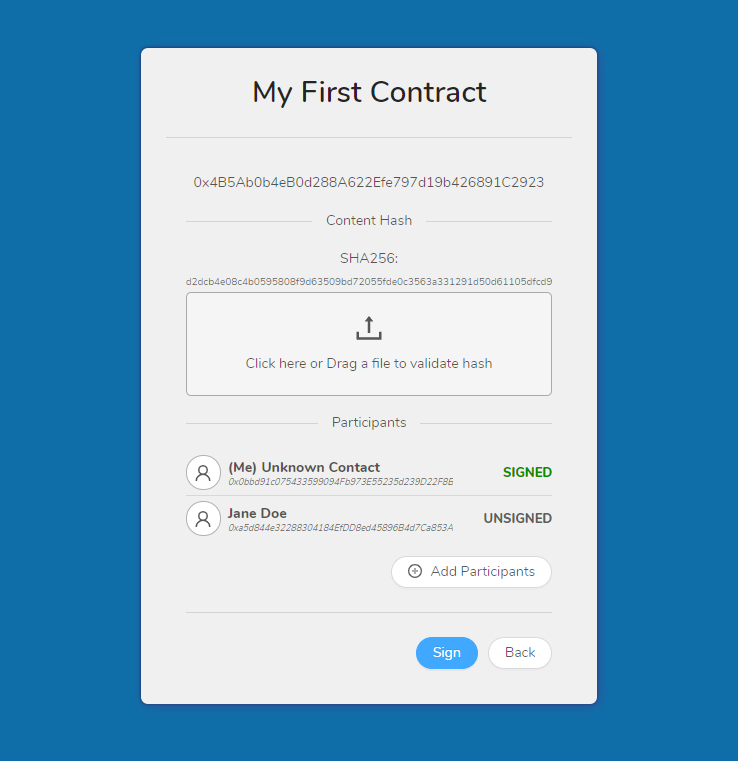

# Digital Signatures on the Blockchain

Prototype Ethereum Dapp (Solidity contracts and React client) for managing and digitally signing contract 
using the Ethereum blockchains cryptographic features. Developed as part of an honours project at the 
University of Waikato.

[Click here for dissertation](resources/Dissertation.pdf)

